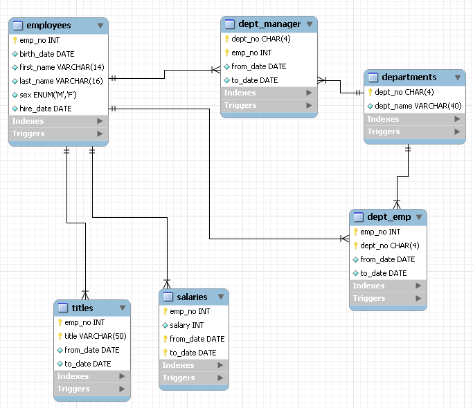

# graphql-practice
This project is an example of running a React application, a GraphQL API, and a MySQL database as Docker containers.

## Getting Started

To run this project locally, follow the steps below.

### Prerequisites

- Docker and Docker Compose must be installed.

### Installation and Execution

1. Clone this repository.

2. Open a terminal and navigate to the root directory of the project.

3. Build and run the Docker containers using the following command:

    ```bash
    docker-compose up --build
    ```

4. To access the React application, go to `http://localhost:3001` in your web browser.

5. To access the GraphQL API, go to `http://localhost:5001`.

## Service Description

### React Application

The React application runs on port `3001`. The source code is located in the `./react-app` directory, and changes to the source code are reflected in real-time.

### GraphQL API

The GraphQL API runs on port `5001`. The source code is located in the `./graphql` directory, and changes to the source code are reflected in real-time.

### MySQL Database

The MySQL database runs on port `33061`. Initial database setup uses the sample database from the [MySQL Employee Sample Database Documentation](https://dev.mysql.com/doc/employee/en/), and it is located in the `./mysql/init` directory.




## Developer

- Name: woogieReal
- Email: woogiereal@gmail.com

## License

This project is licensed under the [License Name] License. See the LICENSE file for details.